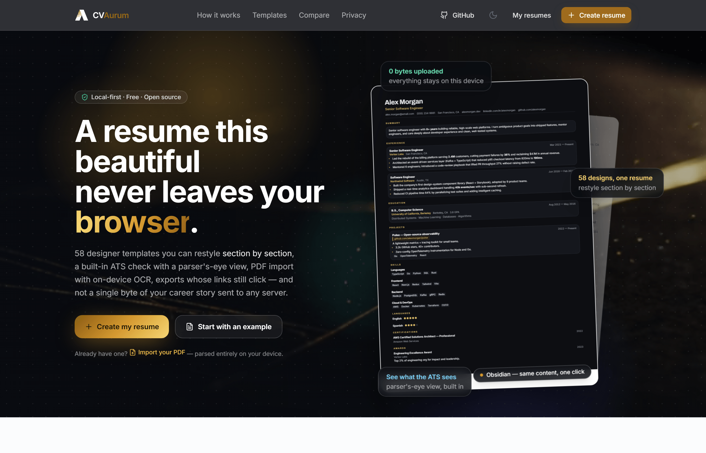
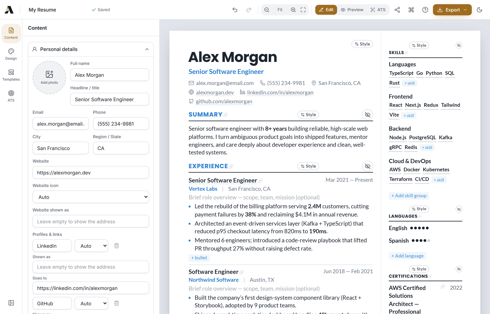
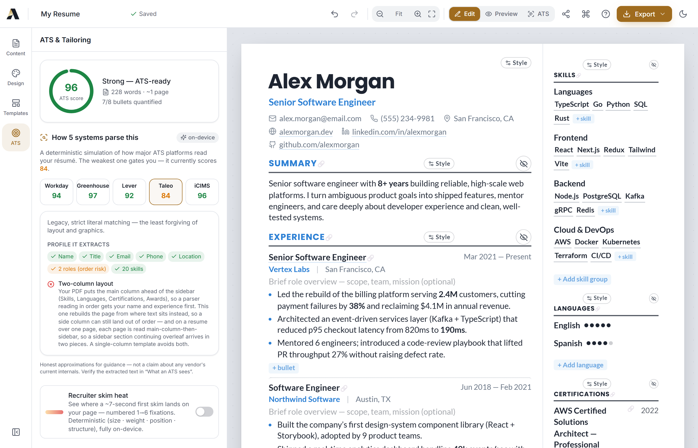
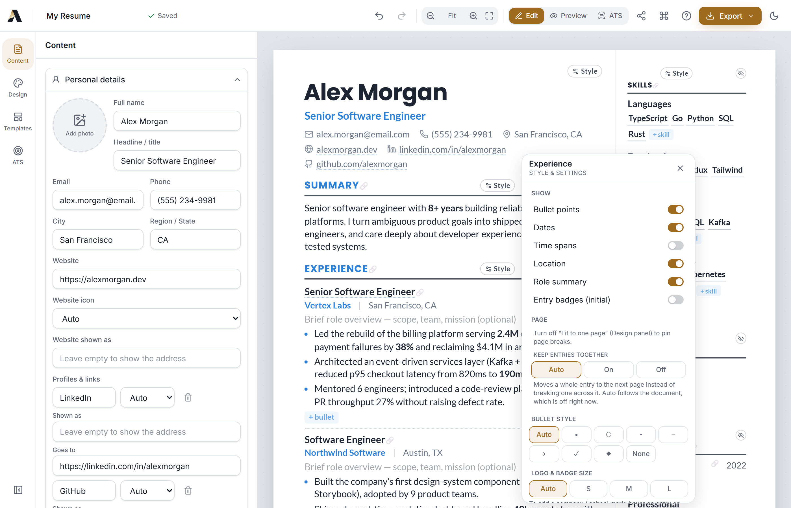
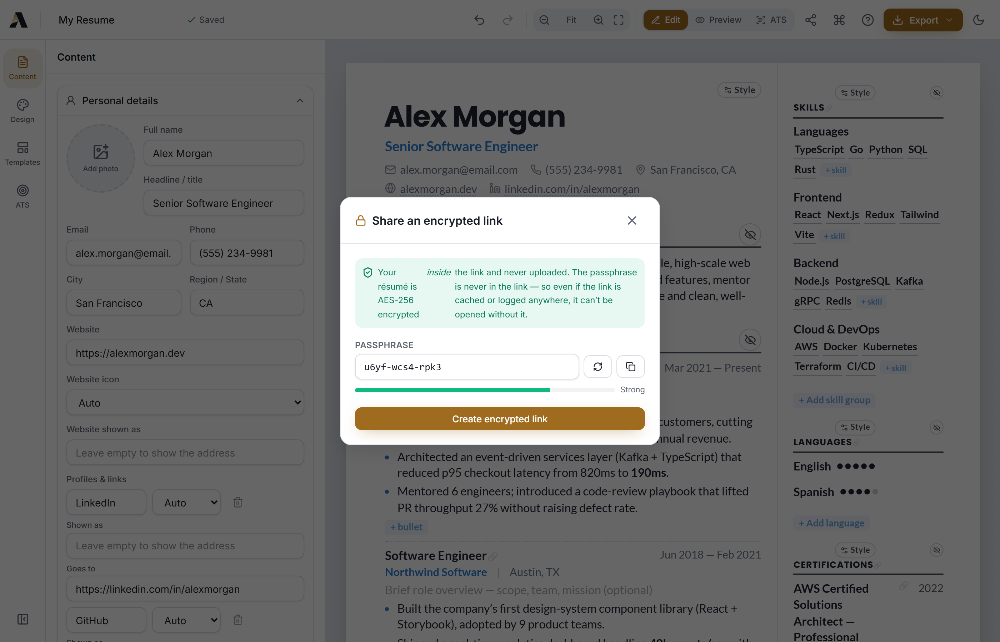
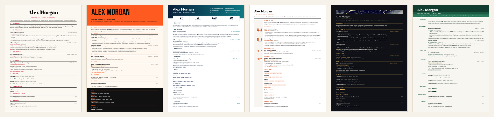
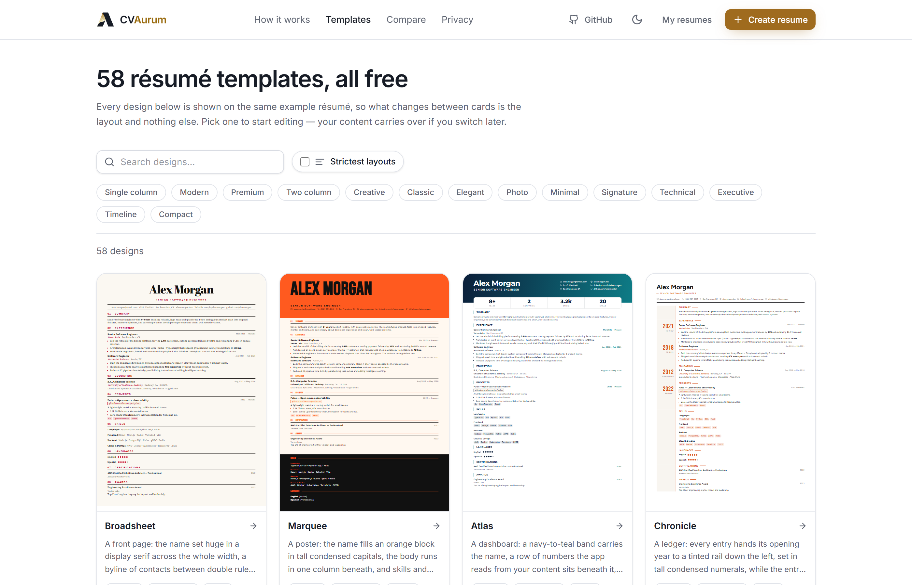

<div align="center">

# CVAurum

### The open-source resume studio.

**Build a beautiful, ATS-ready resume in your browser. 100% local, private, and free.**
**No account. No server. No tracking.**

### 🔗 [**Try it live → cvaurum.com**](https://cvaurum.com)

`100% Client-Side` · `MIT Licensed` · `Node ≥ 18.18` · `Zero Backend`

</div>

---

CVAurum is a beautiful, privacy-first resume builder that runs entirely in your browser. Pick from 58 premium templates — six of them a **Signature collection**, where each design is a different page _structure_ rather than a recolour — edit right on the page, get instant ATS feedback, tailor your resume to a job description, **import an existing PDF résumé**, and export a crisp PDF (drawn by CVAurum's own vector engine, byte-for-byte the page you were looking at) or an ATS-friendly Word document — all without an account, a server, or a single byte of tracking. Install it as an app and it works fully offline. Your data lives in your browser's IndexedDB and never leaves your machine unless **you** send it somewhere.

```bash
npm install && npm run dev
```

That's the entire setup. No Docker, no Postgres, no Redis, no headless Chromium. Just a Vite dev server and your browser.

---

## ✨ Why CVAurum

A resume tool should be beautiful, private, and instant — without asking you to sign up, pay, or trust a server with your career history. CVAurum is built around four ideas:

- **🎨 Design-first.** 58 hand-crafted templates — including a six-design **Signature collection** where the page itself is rebuilt (a numbered running head, a poster block, a band of figures read from your own content, a year rail, a date margin, headings set beside their words) — with real typographic hierarchy, folio section badges (a folded-corner paper chip, with classic icon chips a click away), per-section style switching, and an auto-fit engine that keeps your resume looking sharp on a single page.
- **🔒 Private by architecture.** There is no backend. Your data lives only in your browser. Nothing is ever uploaded, logged, or tracked — and even sharing is an **AES-256 encrypted link** that never touches a server.
- **⚡ Instant, keyboard-first.** One command to start. Edit directly on the resume, drive everything from a **⌘K command palette**, type `/` for quick inserts, and watch a live ATS score update as you type.
- **📄 Archival-grade, accessible PDFs.** Every PDF is drawn by CVAurum's own vector engine — the only export path there is, with no print-dialog fallback behind it — and every export is **PDF/A-2B** (archival) and **PDF/UA-1** (accessibility) conformant, tagged for screen readers and validated with the veraPDF reference validator on every release.
- **📊 ATS you can trust.** A deterministic score plus a **per-ATS parse simulation** (Workday · Greenhouse · Lever · Taleo · iCIMS) and an on-device writing coach — no LLM, no network, same input always the same advice.

---

## 📑 Table of Contents

- [Features](#-features)
- [Screenshots](#-screenshots)
- [Quick Start](#-quick-start)
- [Usage Highlights](#-usage-highlights)
  - [Templates](#templates)
  - [ATS Analysis & Job Tailoring](#ats-analysis--job-tailoring)
  - [Import & Export](#import--export)
  - [PDF Export](#pdf-export)
- [Privacy](#-privacy)
- [Tech Stack](#-tech-stack)
- [Project Structure](#-project-structure)
- [Roadmap](#-roadmap)
- [Contributing](#-contributing)
- [License](#-license)
- [Acknowledgements](#-acknowledgements)

---

## 🚀 Features

### 🎨 Templates & Design

- **58 premium, data-driven templates** — Clarity, Obsidian, Onyx Noir, Cascade, Sapphire, Garnet, Initials, Emblem, Verde, Onyx Gold, Pinnacle, Crest, Ribbon, Orchid, Aurum, Aurum Editorial, Swiss Aurum, Atelier, Harvard, Garamond, Aria, Oxford, Cambridge, Vector, Frost, Sterling, Vertex, Apex, Prism, Linen, Quartz, Lumière, Editorial, Amethyst, Terminal, Nova, Scholar, Onyx, Cobalt, Academia, Verdant, Sienna, Newton, Deedy, Slate, Mercury, Halcyon, Graphite, Portrait, Spotlight, Mono and Opal, plus the six **Signature** designs below — each with folio or icon-chip section headings in three sizes and a refined type scale.
- Most templates are **ATS-safe** and flagged with a shield so you know which ones parse cleanly.
- **A public gallery at [`/templates`](https://cvaurum.com/templates)** — every design rendered live on the same example résumé, searchable and filterable by tag, with the Signature collection leading the wall. The editor's own picker uses the same order.
- **Full typography control:** separate body / heading / name fonts (**45 bundled, self-hosted fonts** — no CDN; **Latin, Cyrillic, Greek and Vietnamese** in every export: 28 families carry Cyrillic themselves, and where a family is Latin-only the page and the PDF both fall back, per script, to a bundled face of the same kind), font size, line-height, letter-spacing, separate size scales for section titles, the headline and the contact line, heading case (upper, small caps, or as typed) and name / heading weights, heading spacing and rule weight (with a per-section heading alignment), bullet indent and bullet spacing, accent colors plus an independent colour for the name, the headline, the section titles, the contact line and links (each Auto until set), spacing, and margins — every slider spans the document's full range and has a typed value box beside it.
- **Layout freedom:** two-column ↔ single-column, **A4 or US-Letter** page size, light / dark / system theme.

#### The Signature collection

Six designs in which the _structure_ of the page changes, not its colours. Each one puts a different structural primitive of the rendering engine onto the paper; all six are single-column and ATS-safe.

| Design         | What it does to the page                                                                                                                                                               |
| -------------- | -------------------------------------------------------------------------------------------------------------------------------------------------------------------------------------- |
| **Broadsheet** | A front page: the name set huge in a display serif across the full width, a byline of contacts between double rules, and **numbered running heads** down one clean column.                |
| **Marquee**    | A poster: the name fills a colour block in tall condensed capitals, the body runs in one column beneath, and skills and languages live in a **dark strip along the foot of the page**.    |
| **Atlas**      | A dashboard: a navy-to-teal band carries the name, and beneath it a **numbers band** of figures the app reads out of your own content — years, companies, projects, a headline figure.    |
| **Chronicle**  | A ledger: every entry hands its opening year to a **tinted rail** down the left, set in tall condensed numerals, while the entry keeps its own real dates in a plain column beside them.  |
| **Folio Noir** | A gallery wall: gold on near-black, a band of art behind the name, a hairline running out of every heading, and each entry's dates and places set in a **narrow margin down the right**.  |
| **Terrace**    | Three steps of green carry the name, the role and the contacts across the top, and beneath them every section title sits in a **column of its own, beside the words it labels**.          |

The structures they introduce are editable, not fixed decoration — see the numbers-band and year-rail controls under [Editing Experience](#-editing-experience).

### 📝 Editing Experience

- **Edit directly on the resume** — click any text on the canvas (name, title, summary, company, bullets…) and type. Changes sync live to the form panel, undo/redo, and autosave. Prefer forms? Both work, always in sync.
- **Live WYSIWYG preview** on an A4 / US-Letter page with **page-break guides** and full multi-page support.
- **Rich text** (TipTap) for summaries and bullet points.
- **Per-section style switching, live on the canvas** — every section’s gear shows **visual previews** of 8 heading styles, 4 skills display styles, and 4 **entry layouts** (timeline, cards, grid, divided). Click a swatch and that section restyles instantly — mix freely per resume, on top of any template.
- **Header layouts** — pick how your name & contacts compose (classic, centered, split, banner, compact) from visual previews in the Design panel, independent of the template.
- **The Signature structures are yours to steer, not decoration.** Atlas's **numbers band** is a list you shape: choose which figures appear (years of experience, companies, projects, certifications, languages, skills, or a headline figure of your own), rename any tile, override a value the app read wrong, reorder them, add up to five. Chronicle's **year rail** derives each entry's year and word from the entry itself ("2021 · to 2024", "2026 · Expected") and any single entry can set its own — so a run of internships can read _INTERNSHIP_ down the rail. Both live in the header's Style popover on the canvas **and** in the Design panel, so a phone reaches them too.
- **Start from an example instead of a blank page** — six ready-made résumés you can open and edit: an experienced engineer, a growth marketer, a recent graduate, a **final-year student** (degree still a year out, two internships under their own heading and on the year rail, one project people actually used), a current student, and a product designer.
- **Built for real content, not just the sample.** A name long enough to wrap, an entry with no dates at all, a rail with nothing to put in it — the layouts hold their shape instead of breaking, and an undated entry leaves its rail or margin empty rather than inventing a year.
- **One-click section starters** — the Add-section gallery offers ready-made ideas (Key Achievements, Strengths, Courses & Training, Conferences & Talks…) beside fully custom sections.
- **Exact-PDF preview** — a segmented **Edit · Preview · ATS** control: Preview strips all editing chrome and renders precisely what will export; ATS shows the plain text a parser reads.
- **⌘K / Ctrl+K command palette** — a keyboard-first, fuzzy-searchable menu for every action: switch any template, set a font or accent, add a section, change canvas mode, export, toggle theme — without touching the mouse.
- **Slash commands** — type `/` in any summary for a quick-insert menu (quantified-bullet template, strong action verbs, %/$ metric placeholders, dates). On-device, no dependency.
- **Focus mode** — dim everything except the section under your cursor for distraction-free editing.
- **Links that read as words, not addresses** — every link keeps its display text separate from its destination, so a link can read "Portfolio" while pointing at your site. One consistent editor (Shown as / Goes to) adds, changes and removes links everywhere they can exist: the contact line, entry titles, section headings, projects, certifications and awards. A project can carry several named links, a credential can end its line with a short verification link (both print as small tags by default, or as plain words), and where a link prints as a word, clicking the word opens its editor. Contacts pick their icon from 20 networks. Every link is also a plain field in the side panel, so nothing requires a mouse or a wide screen.
- **The exports agree with the page** — a site you named "Portfolio" reads as Portfolio in the PDF, in the Word file and in the ATS preview; it does not turn back into `myportfolio.com/work` on the way out. Word links are **real hyperlinks**, including `mailto:` and `tel:` on the contact line. Links are clickable in both exports by default; one switch — right inside every link card, and in Design — turns them all into plain text for a paper submission, and while editing, linked words carry a faint dotted mark (gray when links are off) so you can always see which words are live. Underlining them is a one-switch choice, as is whether named links print as tags or plain words.
- **Editing on a phone** — the canvas is a desktop surface, so on a phone the form panel _is_ the editor: contact icons, links, section heading links, keyword reordering, and the whole per-section style sheet (heading style, skills layout, badge size and shape, bullets) open from the panel, with no horizontal scrolling. The first-run tour says so too — it teaches the phone flow on a phone rather than telling you to hover things a finger cannot.
- **Per-entry logos and credential badges** — add a small company / institution logo beside any experience, education, or volunteering entry, and an **issuer badge beside any certification** (the AWS cube, Google's G) the way credential-heavy resumes print them: badge in its own gutter, name and issuer sharing one clean text edge, a short **Verify** ending the line. All with a friendly cropper and per-section size & shape controls, added straight from the canvas or the panel.
- **Per-section bullet & meter styles** — pick the bullet marker (disc, circle, square, dash, arrow, check, diamond, none) and the skills/languages proficiency meter (dots, bars, stars, text, none) per section.
- **Time spans on date ranges** — a per-section switch ends each range with its length ("2 yrs 3 mos"), as plain text the PDF, the Word file and the ATS view all print alike.
- **Entry order and emphasis** — per section, lead each entry with the title or with the organisation, and choose which of the two is bold, with both fields still editable on the canvas; the PDF, the Word file and the ATS view keep the same order.
- **Location and date placement** — per section, print each entry's location beside its date instead of under the title, and put the date at the right edge or in a column of its own ahead of it; the Word file joins the same pair and the ATS text reads unchanged.
- **Date format and language** — choose how every date reads (short or long month, numeric, or the year alone), what sits between the two ends of a range, the word for a current role, and the language of month names and time spans; the PDF declares that language, and the Word file and the ATS view print the same dates.
- **Drag-and-drop section reordering** (dnd-kit), show/hide sections, custom sections, and section renaming.
- **Visual "Add a section" gallery** — each section is shown as a **live preview rendered in your actual template**, so you see exactly how it will look before adding it.
- **Undo / redo** with `Ctrl+Z` / `Ctrl+Shift+Z` (powered by zundo).
- **Debounced autosave** to IndexedDB — your work is saved as you type.
- **Multi-resume dashboard:** create, duplicate, delete, and import resumes.
- **Job application tracker:** a drag-and-drop kanban board (Wishlist → Applied → Interview → Offer → Rejected) to manage your search.

### 📊 ATS & Job Tailoring

- **Deterministic ATS analysis** — instant, private, and **no LLM required**. Structural checks for contact info, summary, quantified bullets, action verbs, length, ATS-safe layout, and standard headings, plus an overall **ATS score**.
- **Per-ATS parse simulation** — a deterministic, on-device emulation of how five real applicant-tracking systems (**Workday, Greenhouse, Lever, Taleo, iCIMS**) each read your résumé, with a per-system parse score, the profile it would extract, and the specific structural risks (two-column reading order, photos, non-standard headings, keyword stuffing…). The weakest system is the one that gates you. Framed honestly as guidance, not a claim about any vendor's internals.
- **On-device writing coach** — flags weak/vague openers, passive voice, first-person pronouns, clichés, missing metrics, and over-long bullets, each with a concrete fix and stronger-verb suggestions. Pure string analysis; zero network.
- **Recruiter skim heatmap** — see where a ~7-second first skim actually lands on _your_ page: translucent heat over the live canvas plus a numbered **1→6 likely-gaze path**. Fully deterministic (type size · weight · F-pattern position · structure) and fully on-device — the same résumé always produces the same map, so you can iterate against it while you type. Toggle it from the ATS panel or ⌘K.
- **“What ATS sees” view:** one click swaps the designed resume for the exact plain text an ATS parser reads — in its true reading order — so you can verify nothing is lost or scrambled before you apply.
- **Live job-description tailoring:** paste a JD and instantly see **matched vs. missing keywords** and a **match score**.
- **Semantic JD match (optional)** — goes beyond keywords: a small on-device language model ([MiniLM](https://huggingface.co/Xenova/all-MiniLM-L6-v2), Apache-2.0) checks whether each JD requirement is actually _expressed_ in your résumé, even when the wording differs — “built CI pipelines” ≈ “automated build & deploy”. Strictly **opt-in** (a one-time ~34 MB download, **self-hosted from this site — never a third-party CDN**), runs in a worker on your device, and works offline after the first load.

### 📄 Import & Export

- **Import an existing PDF résumé** — drop in a PDF and CVAurum reconstructs it into editable, structured sections (contact, experience, education, skills…) **entirely in your browser — nothing is uploaded.** Text-based PDFs work best; scanned / image-only PDFs are read with **on-device OCR** (self-hosted [Tesseract](https://github.com/naptha/tesseract.js), no cloud). Always give the result a quick review.
- **One-click PDF export** from CVAurum's own in-browser vector engine — **the only export path there is**. Every PDF is **selectable, ATS-exact text** (not a rasterized image), byte-for-byte the document the preview showed you, multi-page where your résumé is, ~50 KB. The button reads **Generating…** while it works, and if the renderer ever fails you are told so — nothing is silently swapped for a print-dialog document made by a different engine. Links are exported as **real clickable regions**, not just underlined words.
- **Word (.docx) export** — a clean, single-column, **ATS-friendly** Word document with real bullet lists, preserved bold, and your template's accent color and fonts; it also follows your page margins, type size, line height and the separator between contacts. Generated entirely in your browser; nothing is uploaded.
- **Import & export JSON Resume files** — built on the [JSON Resume schema](https://jsonresume.org/schema) so your data round-trips with the wider ecosystem.

### 🔐 Secure Sharing

- **Encrypted share links** — send a private link whose résumé rides **inside the URL fragment** (which browsers never send to a server). The payload is **AES-256-GCM** encrypted with a key stretched from your passphrase via **PBKDF2-SHA-256 (600k iterations)** — so even if the link is cached or logged somewhere, it's unreadable without the passphrase (which you share through a different channel). Copy the link, use the native share sheet, or send it over WhatsApp; there is no plaintext link. For full-fidelity sharing with trusted people, export JSON.

### 📲 Installable & Offline (PWA)

- **Install it like a native app** on desktop or mobile (Add to Home Screen / Install).
- **Works fully offline, zero external requests** — all 45 fonts are **bundled** and the whole app is precached by a service worker, so CVAurum never contacts a third-party server (not even for fonts). Build resumes with no connection at all.

### 🔒 Privacy by Default

- No server, no account, no analytics, no tracking, no cookies. (More in [Privacy](#-privacy).)

---

## 📸 Screenshots

<p align="center">
  
</p>

| Edit right on the page                 | See how 5 ATS parse it                             |
| -------------------------------------- | -------------------------------------------------- |
|  |  |

| Restyle any section, live                          | Share an encrypted link                          |
| -------------------------------------------------- | ------------------------------------------------ |
|  |  |

<p align="center">
  
</p>

<p align="center"><em>The Signature collection, first pages straight out of the PDF engine: Broadsheet's numbered running heads · Marquee's poster block and footer strip · Atlas's numbers band · Chronicle's year rail · Folio Noir's date margin · Terrace's side headings.</em></p>

<p align="center">
  
</p>

---

## ⚡ Quick Start

### Prerequisites

- **Node.js ≥ 18.18**
- A modern browser

That's it. No database, no Docker, no background services.

### Run it

```bash
# 1. Install dependencies
npm install

# 2. Start the dev server (http://localhost:5173)
npm run dev
```

Open **http://localhost:5173** and start building. CVAurum makes **zero external network requests** — all 45 fonts are bundled with the app — so it works **fully offline** from the very first load and never contacts a third-party server.

### All scripts

| Command             | What it does                                         |
| ------------------- | ---------------------------------------------------- |
| `npm install`       | Install dependencies                                 |
| `npm run dev`       | Start the Vite dev server on `http://localhost:5173` |
| `npm run build`     | Typecheck + production build to `dist/`              |
| `npm run preview`   | Preview the production build locally                 |
| `npm run typecheck` | `tsc --noEmit`                                       |
| `npm test`          | Run the unit tests (Vitest)                          |
| `npm run format`    | Run Prettier                                         |

---

## 🧭 Usage Highlights

### Templates

Choose from **58 templates** and switch between them at any time — your content stays put while the design changes. Browse the whole wall at **[cvaurum.com/templates](https://cvaurum.com/templates)**, where every design is rendered live on the same example résumé and the six **Signature** designs lead the list; the editor's picker shows them in the same order. ATS-safe templates are marked with a **shield** so you can pick a layout that parses cleanly through applicant tracking systems. Fine-tune fonts, colors, spacing, margins, and page size to make any template your own.

The Signature designs go further than a palette swap: switching to one changes how the page is built (a numbered running head, a poster block, a band of figures, a year rail, a date margin, headings beside their content), and the structures it introduces come with their own controls — see [the Signature collection](#the-signature-collection).

### ATS Analysis & Job Tailoring

The **ATS engine is fully deterministic** — it runs instantly, in your browser, with **no LLM and no network call**. It checks for the things real applicant tracking systems care about: contact details, a summary, quantified and action-verb-driven bullets, appropriate length, an ATS-safe layout, and standard section headings — then rolls everything into an overall **ATS score**.

Want to target a specific role? Paste the **job description** into the tailoring panel and CVAurum highlights **matched vs. missing keywords** and gives you a live **match score** so you know exactly what to add.

### Import & Export

**Bring in an existing PDF résumé** — CVAurum parses it into structured, editable sections right in your browser (the file is never uploaded). It detects columns, headings, dated entries, bullets, and contact details deterministically; **scanned or image-only PDFs fall back to on-device OCR** (a self-hosted Tesseract engine, loaded only when needed). PDF parsing is best-effort, so review the imported fields before you rely on them.

CVAurum also speaks the **[JSON Resume schema](https://jsonresume.org/schema)**, with CVAurum's visual metadata namespaced under `meta.cvaurum`. That means you can:

- **Import** an existing JSON Resume file and keep editing.
- **Export** your resume as JSON Resume — exports **round-trip** with the JSON Resume ecosystem, and the `meta.cvaurum` namespace preserves your template, fonts, and layout choices.

Imports are validated with **Zod**, so bringing in a file is safe and predictable.

### PDF Export

CVAurum generates your PDF **directly in the browser with its own vector rendering engine** — one click, no print dialog, nothing uploaded. **100% of exports go through that engine; there is no fallback path.** The export is true vector output: **real selectable text that round-trips exactly** through ATS parsers (verified across every template against the on-screen preview and against parser-view extraction), icons and accents as sharp vectors at any zoom, photos at original quality, and compact file sizes (~50 KB typical). Export is visible while it happens — the menu item reads **Generating…** — and a renderer failure is reported as a failure rather than hidden behind a different document.

Every export is validated by an automated gate before a template ships: the text layer must match the preview **exactly**, the reading order must be what a recruiter's parser expects, and the pixels must match the screen at least as faithfully as a browser's own print output would.

**Every export conforms to two ISO standards at once**, verified on every release against [veraPDF](https://verapdf.org/), the industry reference validator:

- **PDF/A-2B** (ISO 19005-2) — the archival profile, with all fonts and an sRGB colour profile embedded so the file reproduces identically years from now. _144/144 rules, 0 failures._
- **PDF/UA-1** (ISO 14289-1) — the accessibility standard. The export is **fully tagged**: headings, paragraphs and bullet lists are real structure elements, and decoration is marked as an artifact, so a screen reader announces _"heading level 2, Experience"_ instead of guessing from font sizes. _106/106 rules, 0 failures._

The structure tree also carries **logical reading order**, not paint order: on a sidebar template your name is announced first, even though the sidebar is painted first.

Conformance is enforced across single-page, two-column, image-heavy and multi-page documents, and re-checked on the production build under its real Content-Security-Policy. Offline exports are conformant too — the colour profile is precached.

**Your PDF carries proper document properties**, not a toolchain fingerprint: title, author, subject, keywords, creation date and a declared document language, in an XMP metadata packet (PDF 2.0 retires the legacy info dictionary, so XMP is the single source of truth). Readers show _your name_ in the title bar instead of the filename — and no library name appears anywhere in the file.

**Multi-page resumes export natively with clean page breaks** — the engine breaks pages at section or entry boundaries (never mid-line), and the editor preview breaks at exactly the same places, so the page count and boundaries you see are the ones you get. Pin any section — or any single entry — to start on a new page, from its canvas controls or from its card in the panel. Turn on **Keep entries whole** (Design → Page, or one section at a time in its Style sheet) and a break never lands inside a job or a degree: the whole entry moves to the next page instead.

---

## 🔒 Privacy

Privacy isn't a feature bolted on — it's the architecture.

- **No server.** There's no backend to send your data to.
- **No account, no login.** Just open the app and start.
- **No analytics, no tracking, no cookies.**
- **Zero external requests.** Fonts are bundled, so the app contacts **no third-party server at all** — not even a font CDN. Nothing about you (not even your IP) is exposed to anyone.
- **All resume data is stored locally** in your browser's **IndexedDB** (via `idb-keyval`).
- **Clearing your site data deletes it** — you are always in full control.

Your resume data never leaves your browser unless **you** explicitly export it (as a PDF or a JSON file) or import a file you picked.

---

## 🛠 Tech Stack

Everything is **client-side**:

| Concern                  | Library                                                        |
| ------------------------ | -------------------------------------------------------------- |
| UI framework             | **React 18** + **Vite** + **TypeScript**                       |
| Styling / theming        | **Tailwind CSS v3** (design tokens, dark mode)                 |
| State                    | **Zustand** + **zundo** (undo/redo)                            |
| Drag & drop              | **dnd-kit**                                                    |
| Animation                | **Framer Motion**                                              |
| Rich text                | **TipTap**                                                     |
| Validation / safe import | **Zod**                                                        |
| Local persistence        | **idb-keyval** (IndexedDB)                                     |
| PDF export               | **CVAurum's own vector engine** (`src/lib/pdf/`) — no external renderer, no print path |
| Word export              | **docx** (in-browser .docx generation)                         |
| Offline / installable    | **vite-plugin-pwa** (Workbox service worker)                   |
| Icons                    | **lucide-react**                                               |
| Data contract            | **JSON Resume schema** + CVAurum metadata under `meta.cvaurum` |

---

## 🗂 Project Structure

```text
src/
├── types/        JSON Resume schema + metadata (Zod)
├── data/         fonts registry, sample resume, example personas, defaults
├── store/        Zustand stores (resume w/ undo-redo, app/settings, editor UI)
├── lib/          ats.ts (ATS engine), atsSimulate.ts (per-ATS parse simulation),
│                 io.ts (import/export), docx.ts (Word export), stats.ts + rail.ts
│                 (numbers band & year rail), storage.ts (IndexedDB), sections.ts, utils
├── lib/pdf/      the native vector PDF engine — render.tsx, paginate.ts, paint.ts,
│                 text.ts, links.ts, tagging.ts (PDF/UA), pdfa.ts (PDF/A), export.ts
├── templates/    rendering engine (_shared/Artboard + section renderers),
│                 registry.ts (58 template configs), templates.css (per-template styling),
│                 TemplateRenderer
├── components/   editor/ (panels, field editors, dnd), preview/, ui/
├── app/          router
├── routes/       Landing, Templates + TemplatePage (the public gallery), Dashboard,
│                 EditorRoute, PrintPage, ShareReceive, Tracker (job board)
└── styles/       artboard.css (resume base styles), print.css
```

---

## 🗺 Roadmap

Planned and under consideration:

- **More templates** _(ongoing)_
- **Sharper PDF import** — better reading order for dense two-column layouts, and a confidence/review pass on imported fields _(planned)_
- **Constraint-solver one-page auto-fit**, **style painter** (copy a section's look onto others), and **version history** with visual diff _(planned)_
- **More Signature structures** — the collection is six designs deep; the engine's structural primitives can carry more _(ongoing)_

✅ **Shipped:** 58 templates, including the six-design **Signature collection** (Broadsheet · Marquee · Atlas · Chronicle · Folio Noir · Terrace) · a public template gallery at `/templates` · per-section style switching · numbers-band and year-rail controls · per-entry logos (editable right on the canvas) · recruiter skim heatmap · opt-in on-device semantic JD matching (MiniLM) · ⌘K command palette · slash commands · focus mode · per-ATS parse simulation (Workday/Greenhouse/Lever/Taleo/iCIMS) · on-device writing coach · local PDF résumé import (text + on-device OCR) · **native vector PDF as the only export path** & Word (.docx) export · AES-256 encrypted share links · full offline PWA.

Have an idea? Open an issue and let's talk.

---

## 🤝 Contributing

Contributions are welcome and appreciated! Whether it's a new template, a bug fix, docs, or a feature from the roadmap, we'd love your help.

- Browse the open issues to find something to work on.
- Run `npm run typecheck` and `npm run build` before opening a PR.
- See [`CONTRIBUTING.md`](./CONTRIBUTING.md) for full guidelines, and [`docs/TEMPLATES.md`](./docs/TEMPLATES.md) to add a template (the easiest way to contribute).

If you build something cool with CVAurum, tell us about it!

---

## 📄 License

CVAurum is released under the **MIT License**. See [`LICENSE`](./LICENSE) for details.

---

## 🙏 Acknowledgements

- **[JSON Resume](https://jsonresume.org)** — for the open schema that makes CVAurum's data portable and interoperable.
- The open-source community behind React, Vite, Tailwind, Zustand, dnd-kit, TipTap, and the many libraries that make CVAurum possible.

---

<div align="center">

**If CVAurum helps you land an interview, consider giving the repo a ⭐ — it really helps.**

Built with care, for everyone job hunting. · [Report an issue](https://github.com/akhil-dara/cvaurum/issues) · [Star the repo](https://github.com/akhil-dara/cvaurum)

</div>
